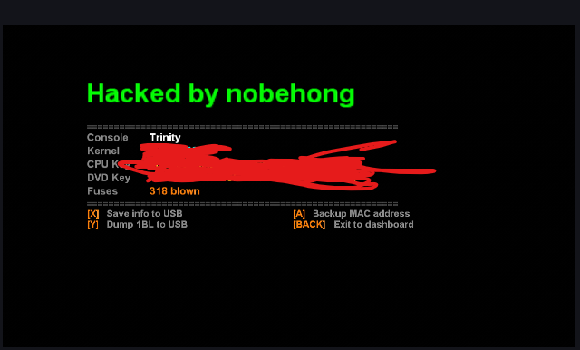

# NobehongHack — Xbox 360 Bad Update Payload

Custom payload for the [Bad Update](https://github.com/grimdoomer/Xbox360BadUpdate) exploit on dashboard **17559**. Uses an improved exploit version that is faster and more reliable than normal Bad Update.

Shows console info (CPU key, DVD key, kernel version, fuse count) and lets you save it to USB.

## What you need

- Xbox 360 on dashboard **17559** (do not update)
- USB drive (FAT32)
- Rock Band Blitz disc or digital copy

## Setup

1. Copy the `BadUpdatePayload` folder to the **root of your USB drive**
2. Get the Rock Band Blitz save from the Bad Update release and copy the `Content` folder to the root of your USB drive
3. Plug the USB into your Xbox 360
4. Launch Rock Band Blitz and load the save from storage
5. The exploit fires automatically — wait for the payload to load

## Payload controls

| Button | Action |
|--------|--------|
| X | Save console info to USB (`BadUpdatePayload\console_info.txt`) |
| Y | Dump 1BL ROM to USB |
| A | Backup MAC address |
| BACK | Exit to dashboard |

## Info displayed

- Console type (motherboard)
- Kernel version
- CPU key (fuse lines 3 + 5)
- DVD key
- Blown fuse count

## Credits

- Bad Update exploit by [grimdoomer](https://github.com/grimdoomer/Xbox360BadUpdate)
- HV patching by [XeUnshackle](https://github.com/Byrom90/XeUnshackle)
- Payload by nobehong
