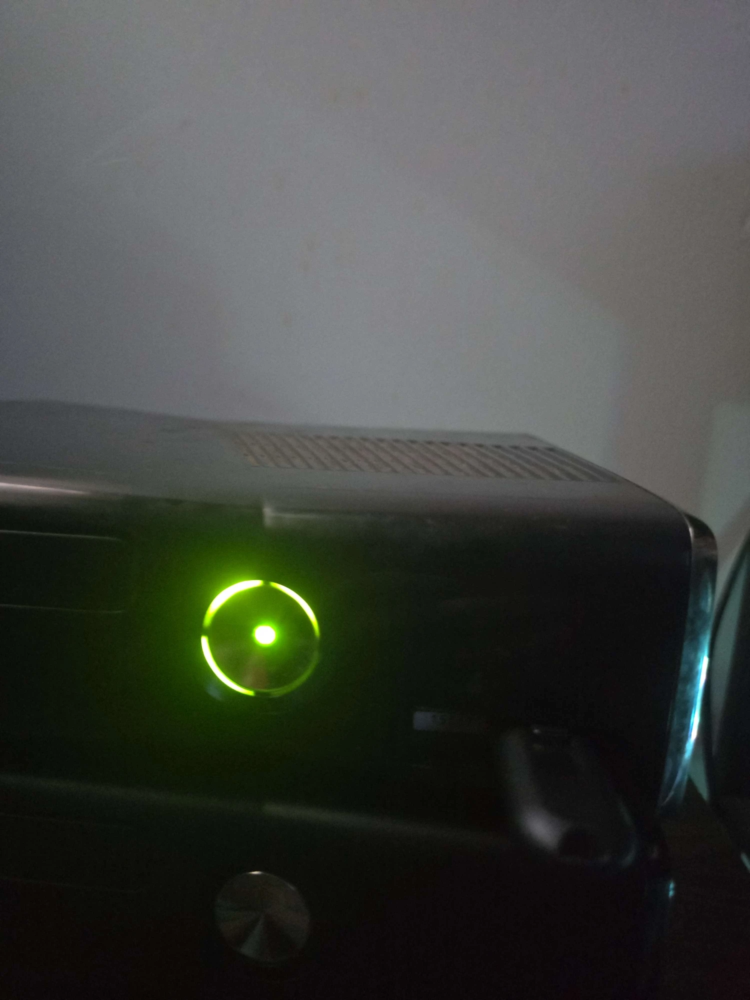

# NobehongHack — Xbox 360 Bad Update Payload

Custom payload for the [Bad Update](https://github.com/grimdoomer/Xbox360BadUpdate) exploit on dashboard **17559**. Uses an improved exploit version that is faster and more reliable than normal Bad Update. Also supports [ABadAvatar](https://github.com/shutterbug2000/ABadAvatar) — no game needed.

Shows console info (CPU key, DVD key, kernel version, fuse count) and lets you save it to USB. The ring of light will show on the console to confirm the exploit ran correctly.

## What you need

- Xbox 360 on dashboard **17559** (do not update)
- USB drive (FAT32)

## Setup — Bad Update (Rock Band Blitz)

1. Copy everything inside the `BadUpdate` folder to the **root of your USB drive**
2. Plug the USB into your Xbox 360
3. Launch Rock Band Blitz and load the save from storage
4. The exploit fires automatically — wait for the payload to load

## Setup — ABadAvatar (no game needed, slower than Bad Update)

1. Copy everything inside the `ABadAvatar` folder to the **root of your USB drive**
2. Make sure your console has fully animated avatars installed (not grey silhouettes)
3. Plug the USB into your Xbox 360
4. Go to the profile select screen — the exploit fires automatically

## Payload controls

| Button | Action |
|--------|--------|
| X | Save console info to USB (`BadUpdatePayload\console_info.txt`) |
| Y | Dump 1BL ROM to USB |
| A | Backup MAC address |
| BACK | Exit to dashboard |

## Info displayed

- Console type (motherboard)
- Kernel version
- CPU key (fuse lines 3 + 5)
- DVD key
- Blown fuse count

## Credits

- Bad Update exploit by [grimdoomer](https://github.com/grimdoomer/Xbox360BadUpdate)
- ABadAvatar by [shutterbug2000](https://github.com/shutterbug2000/ABadAvatar)
- HV patching by [XeUnshackle](https://github.com/Byrom90/XeUnshackle)
- Payload by nobehong
